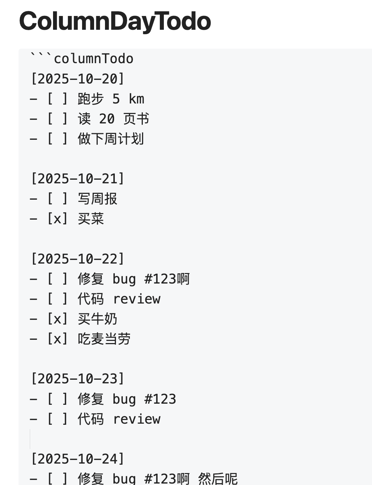
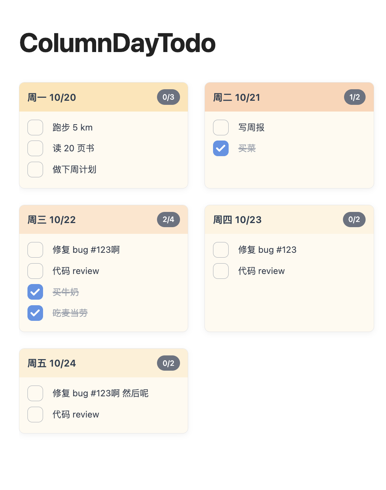

# Column Todo Cards

一个为 Obsidian 设计的插件，以美观的卡片形式展示待办事项，支持编辑模式实时预览。

## 预览

## 功能特性

- 📅 以卡片形式展示待办事项
- ✅ 支持在编辑模式下直接勾选完成任务
- 🎨 每列使用不同的温暖色调区分
- 📱 响应式设计，移动端友好
- ⚡ 实时预览，无需切换到阅读模式
- ⚙️ 可自定义卡片宽度和间距

## 使用方法

在你的笔记中创建一个 `columnTodo` 代码块：

\`\`\`columnTodo  

[2025-10-20]
- [ ] 跑步 5 km
- [ ] 读 20 页书

[2025-10-21]
- [ ] 写周报
- [x] 买菜

[2025-10-22]
- [ ] 修复 bug #123
- [ ] 代码 review
\`\`\`

插件会自动将其渲染为卡片式视图，并且：
- 在编辑模式下也能看到渲染效果
- 可以直接点击复选框标记完成
- 会自动更新原始文本

## 自定义配置

插件提供了设置页面，你可以自定义：

1. 打开 **设置 → Column Todo Cards**
2. 调整以下参数：
   - **Card Width**: 每张卡片的宽度（像素）
     - 推荐范围：250-350px
     - 默认：280px
   - **Card Gap**: 卡片之间的间距（像素）
     - 推荐范围：8-24px
     - 默认：16px

修改后关闭并重新打开笔记即可看到效果。

## 安装

插件已经安装在你的 vault 中。如果需要重新加载：

1. 打开 Obsidian 设置
2. 进入「第三方插件」
3. 找到「Column Todo Cards」并启用
